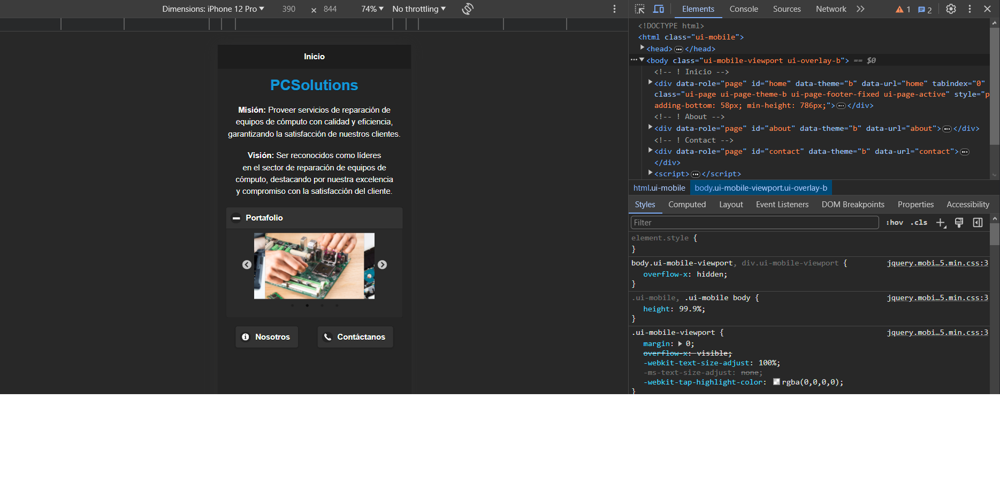

# Primer App en jQuery Mobile
Esta aplicacióne es la primer práctica para **Desarrollo Móvil Multiplataforma**, el objetivo es aprender a usar las librerías de **jQuery** y **jQuery Mobile** para crear aplicaciones móviles multiplataforma.

  

## Como Usar 💻
> [!NOTE]
> Para mejor experiencia durante el uso de la app, es recomendable usar un **dispositivo móvil** o en dado caso, usar las herramientas de desarrollador y activar el **modo responsivo móvil**.

La app está actualmente hosteada en **Vercel** y puedes usarla en el siguiente [enlace](https://j-query-m-pc-solutions-app.vercel.app)_.

  

